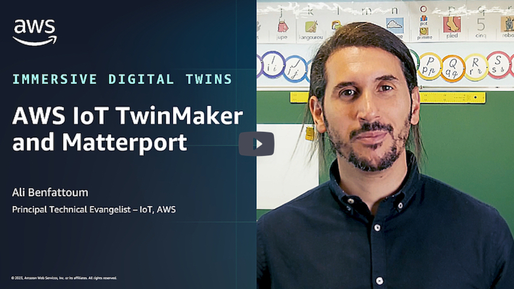
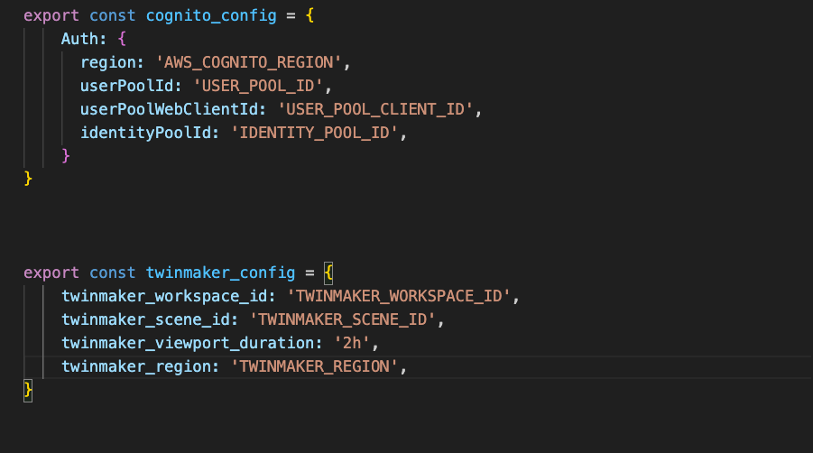

This repo is an example of a Next.js application demonstrating [AWS IoT TwinMaker and Matterport integration](https://docs.aws.amazon.com/iot-twinmaker/latest/guide/tm-matterport-integration.html) using [AWS IoT App Kit library](https://awslabs.github.io/iot-app-kit). 


## Introduction 

With the AWS IoT TwinMaker and Matterport integration, developers can now leverage Matterport’s technology to combine existing data from multiple sources with real-world data to create a fully integrated digital twin. 

You can use Matterport spaces in your AWS IoT TwinMaker web application by using the AWS IoT application kit library. 

[](https://youtu.be/n8aFJRKHpuk "Immersive Digital Twins with AWS IoT TwinMaker and Matterport")

## Prerequisites

To use the following application, you need the following: 

- You have purchased an Enterprise-level [Matterport](https://my.matterport.com/) account and the Matterport products necessary for the AWS IoT TwinMaker integration.
- You have an AWS IoT TwinMaker workspace. For more information, see [Getting started with AWS IoT TwinMaker](https://docs.aws.amazon.com/iot-twinmaker/latest/guide/twinmaker-gs.html).
- You have generated your Matterport credentials and stored them in AWS Secret Manager as described in [Store your Matterport credentials in AWS Secrets Manager](https://docs.aws.amazon.com/iot-twinmaker/latest/guide/tm-matterport-integration.html#tm-matterport-integration-secrets)
- You have updated your AWS IoT TwinMaker workspace role to have access to your Matterport credentials in AWS Secrets Manager. See [Matterport integration prerequisites](https://docs.aws.amazon.com/iot-twinmaker/latest/guide/tm-matterport-integration.html#tm-matterport-integration-prereqs) for more information. 
- You have created an [Amazon Cognito user pool](https://docs.aws.amazon.com/cognito/latest/developerguide/tutorial-create-user-pool.html) and an [Amazon Cognito identity pool](https://docs.aws.amazon.com/cognito/latest/developerguide/tutorial-create-identity-pool.html). The user created in the Amazon Cognito Pool [needs the access](https://docs.aws.amazon.com/iot-twinmaker/latest/guide/dashboard-IAM-role.html) to Amazon S3 bucket and AWS IoT TwinMaker resources. 

Watch the video above for a step by step guide to set up the required resources. 

## Getting started

We assume you have imported your Matterport space into a TwinMaker scene and have a Cognito user with all the permissions to fetch the scene. 

1) Configure your application by providing the required information in the file [aws.config.js](./aws.config.ts). 




2) Then install the libraries using the following command: 

```bash
npm install --legacy-peer-deps
```

3) Finally launch the application using the following command: 

```bash
npm run dev 
```

Once you sign in using the credentials of your cognito user, you should then see your Matterport space. 

## Additional Resources

This section provides links to additional resources that may help deploy and operate this application:
- [Build a Digital Twin using the Smart Territory Framework and AWS IoT TwinMaker video](https://youtu.be/iSFtl46h6Vw)
- [Getting started with AWS IoT TwinMaker](https://docs.aws.amazon.com/iot-twinmaker/latest/guide/twinmaker-gs.html). 
- [AWS IoT TwinMaker Matterport integration](https://docs.aws.amazon.com/iot-twinmaker/latest/guide/tm-matterport-integration.html#tm-matterport-integration-prereqs).


## Security

See [CONTRIBUTING](CONTRIBUTING.md#security-issue-notifications) for more information.

## License

This library is licensed under the MIT-0 License. See the LICENSE file.